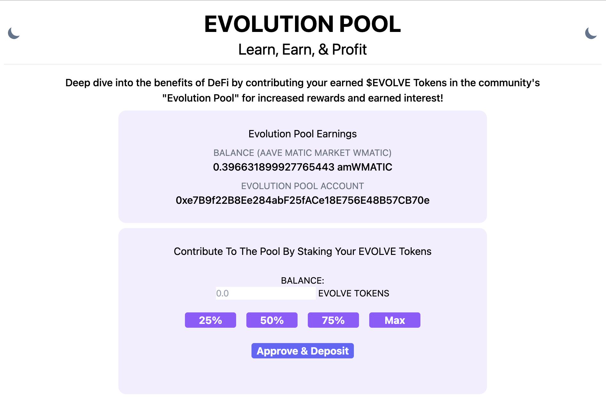

# ✨ Welcome to EVOLVE's Evolution Pool DApp✨



---

# ℹ️ Project Description

<p>
This repository contains the code for the <b>Evolution Pool</b> which is a component of EVOLVE's Education and Finance DApp. This is where user's can choose to deposit a percentage of their earned $EVOLVE tokens into a community pool. Funds deposited into the community pool are put to work with AAVE's Lending and Borrowing Protocol so that users are able to collectively invest and earn a greater APY together. 💖
</p>

---

# 🌈 [Check Out The Live Demo](evolution-pool-dapp.vercel.app)

### Demo Instructions: 
* Step One: 
  * Make sure your account is funded with MATIC
    * [Get Test Matic from The Polygon Faucet (Mumbai Network)](https://faucet.polygon.technology/) 
  * Make sure your wallet is connected to the Polygon Mumbai Test Network
* Step Two:
  * Exchange Your MATIC for wMATIC on the DApp
* Step Three:
  *  Deposit your wMATIC into the Evolution Pool to start earning interest! In this demo you earn amwMATIC. 
---

# 🏄‍♂️ Quick Start - For Developers
### Before you clone this project make sure you have the following installed on your machine (in this order)!

* [Node.js](https://nodejs.org/en/) 
* [Yarn](https://classic.yarnpkg.com/en/docs/install/)
* [Git](https://git-scm.com/downloads)

### You can check if you have these installed by running these commands on your terminal:

```bash
node -v
npm -v
yarn -v
git --version
```

### Fund Your Account(s) with MATIC:
* [Polygon Faucet (Mumbai Network)](https://faucet.polygon.technology/)

---
### Let's Get Building! 🔨
* First, fork this project by clicking the fork button in the upper right hand corner of the repo page.
* Second, open your terminal and run the following command with the correct inputs.

```bash
git clone https://github.com/<YOUR-USERNAME>/<YOUR-REPOSITORY-NAME>
```
---
### Install all project 👷‍ dependencies by changing directories into `smart-contracts/` and then, `front-end/` and running `yarn install`:

* On a terminal window open, navigate inside of the hardhat folder and run `yarn install`:
```bash
cd /smart-contracts
yarn install
```
* Open another terminal window, navigate inside of the next-app folder and run `yarn install`
```bash
cd /front-end
yarn install
```
* Ready to Run The Front-End & Interact with The EVOLUTION POOL SMART CONTRACTS:! 💘
```bash
cd /front-end
yarn dev
```
> Open http://localhost:3000 to see the application front-end/interface!

# You can also use these commands - you can look at `package.json` to checkout the scripts
```
yarn build
yarn start
yarn lint 
```
---
### 💡 You will have two terminal windows open: One for your front-end & one for smart contract development.
* Navigate to /smart-contracts README.md for more information on commands to run for compiling/deploying smart contracts.
* Navigate to front-end/README.md for more information on commands to run for running your front-end
---

#### CREDITS (Thank you for awesome code that I was able to learn from!):
* [Front-End Staking](https://github.com/cpascoli/lp-token-staking)
* [Front-End Boiler Plate](https://github.com/arisac/dapp-starter)
* [Front-End](https://github.com/womenbuildweb3/Web3RSVP-frontend)
* [Barber-to-Customer Escrow](https://github.com/Okiki-Olugunna/Barber-to-Customer-Escrow)
* [ERC20 Token Staking](https://github.com/0xBonanza/Solidity-erc20-staking)
